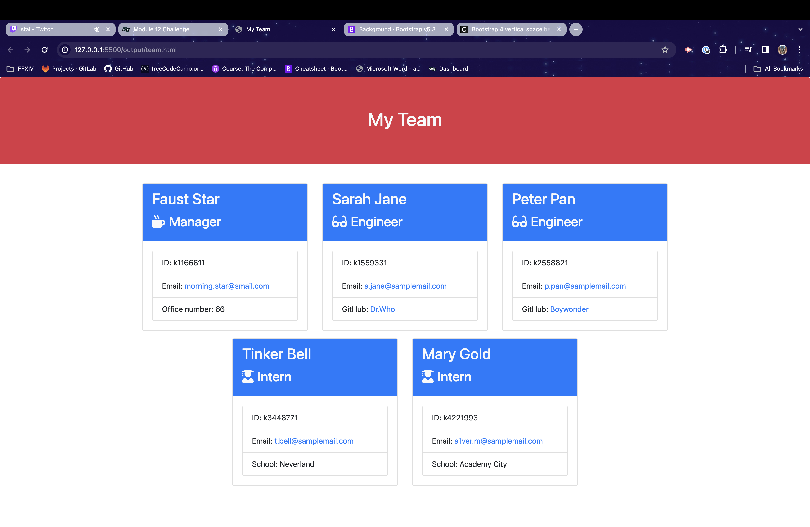

# TeamProfileGenerator
 
## Description
    AS A manager
    I WANT to generate a webpage that displays my team's basic info
    SO THAT I have quick access to their emails and GitHub profiles

## Table of Contents
[Description](#description)  

[Installation](#installation)

[Usage](#usage)

[Test](#test)

[Contribution](#contribution)

[License](#license)

## Installation
To run this application, the inquirer need to be installed using the node command:

    npm i inquirer

once installed, to generate the data assigned to each cards the node command:

    node index.js

## Usage
This project uses jest in the testing phase to complete the checkmarks needed to be completed for this project. Inquirer was also used for the question prompt for each cards.

## Test

[Team Profile](output/team.html)

## Contribution
[ES6 Javascript](https://www.youtube.com/watch?v=NCwa_xi0Uuc&t=1171s)

## License
[MIT](LICENSE)

